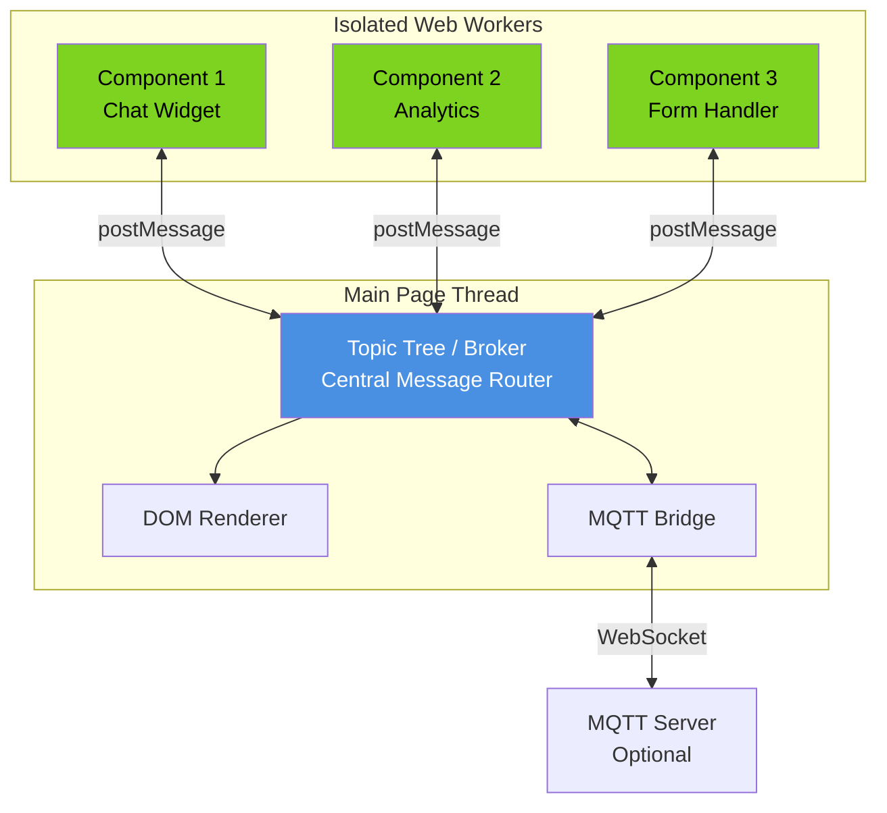
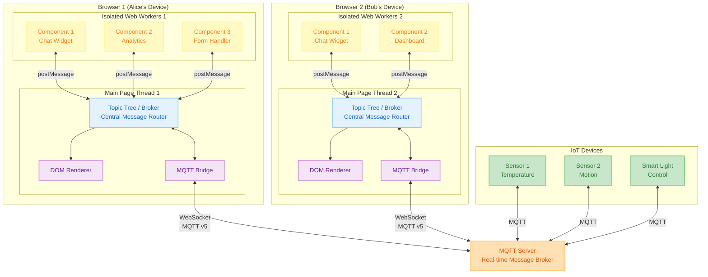
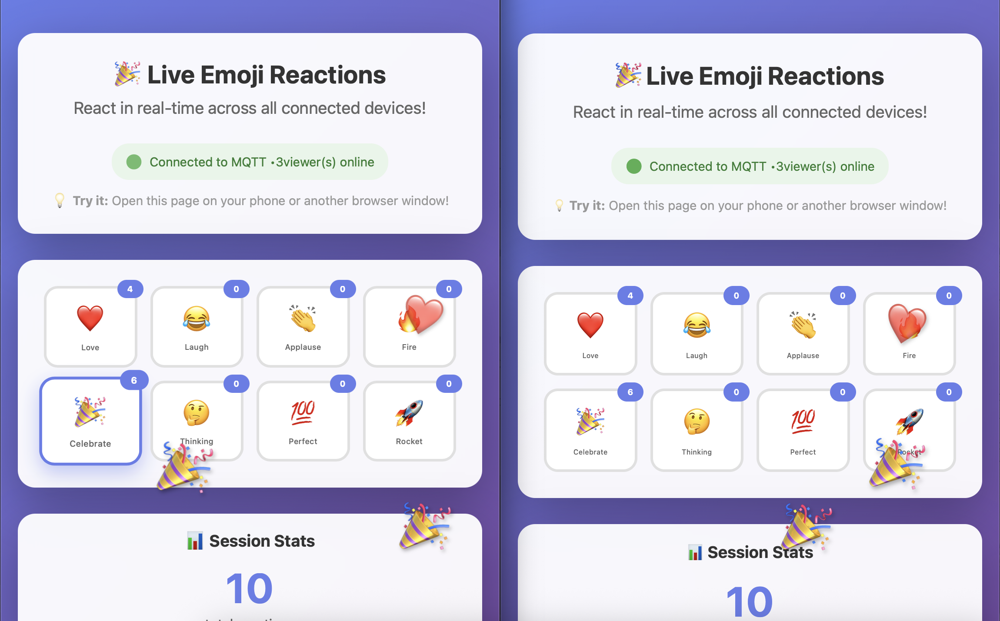

# COTONIC

*Build web apps with truly isolated components using Web Workers and
pub/sub messaging.*

Think microservices architecture, but for the browser—with privacy
and crash isolation built in.

**The problem:** Third-party scripts can access everything on your page.
Passwords, user data, everything.  
**The solution:** Cotonic isolates components like an OS isolates processes,
using Web Workers and message passing.

Read the [documentation](https://cotonic.org/)

## What is Cotonic?

Cotonic is a JavaScript framework that brings operating-system level isolation to web applications.
Each component runs in its own Web Worker, communicating through an MQTT-inspired topic tree.

## Architecture

### The Cotonic Difference

**Without Cotonic:** All code runs in a shared global scope with no isolation.

**With Cotonic:** Each component runs in its own Web Worker, communicating only through messages.

```
Traditional Web App              Cotonic Web App
─────────────────               ─────────────────

┌─────────────────┐             ┌─────────────────┐
│  Global Scope   │             │   Main Thread   │
│                 │             │   ┌─────────┐   │
│  All components │             │   │ Topic   │   │
│  share          │             │   │ Tree    │   │
│  everything     │             │   └────┬────┘   │
└─────────────────┘             └────────┼────────┘
                                     ┌───┼───┐
 ❌ No isolation                  ┌──▼─┐ ▼ ┌▼──┐
 ❌ Privacy risks                 │ W1 │   │W2 │
 ❌ Cascade fails                 └────┘   └───┘
                                  ✅ Isolated
                                  ✅ Secure
                                  ✅ Resilient
```

### How It Works



**Key principle:** Workers never call each other directly. All communication flows
through the topic tree, enabling true isolation and composability.

### Real-World Example

Imagine a collaborative smart office dashboard:

1. **Alice** clicks "Start Meeting" in her browser's form handler component
2. The component publishes to `bridge/origin/office/meeting/start`
3. The **MQTT server** receives the message and forwards it to all subscribers:
   - **Bob's browser** (in another office) receives the message and his dashboard component shows "Meeting in Progress"
   - **Temperature sensor** (IoT1) publishes current room temperature to `office/sensors/temp`
   - **Smart light** (IoT3) changes to "meeting mode" (red light)
   - **Motion sensor** (IoT2) activates to track room occupancy
4. Bob's **analytics component** aggregates the meeting data and publishes stats to `office/analytics/meetings`
5. Both Alice's and Bob's dashboards update in real-time



**All of this happens through simple pub/sub messages** No direct connections,
no REST APIs to manage, no polling. Components, browsers, and devices are loosely
coupled and can be added, removed, or crash independently without affecting the system.

## Quick Start

### Hello World: Basic Pub/Sub

The simplest example, components talking through topics:

```javascript
// Component A: Subscribe to a topic
cotonic.broker.subscribe("user/clicked", (msg) => {
    console.log("Button was clicked!", msg.payload);
});

// Component B: Publish to that topic
cotonic.broker.publish("user/clicked", { 
    button: "save",
    timestamp: Date.now() 
});
```

### Hello World: Isolated Web Worker Component

The real power, components running in isolated Web Workers:

```javascript
// main.js - Start an isolated component
cotonic.spawn({
    src: 'workers/counter.js',
    topic: 'component/counter'
});

// Subscribe to messages from the worker
cotonic.broker.subscribe("counter/value", function(msg) {
    document.getElementById('display').textContent = msg.payload;
});

// Send a message to the worker
cotonic.broker.publish("counter/increment", {});
```

```javascript
// workers/counter.js - Runs in isolated Web Worker
let count = 0;

cotonic.broker.subscribe("counter/increment", function() {
    count++;
    cotonic.broker.publish("counter/value", count);
});
```

**Why this matters:** The counter worker is completely isolated. It can't
access the DOM, can't interfere with other components, and if it crashes,
your page keeps running.

### Hello World: Real-time Server Sync (Optional)

Connect to your MQTT server for real-time sync:

```javascript
// All clients get this message in real-time
cotonic.broker.subscribe("bridge/origin/notifications/#", (msg) => {
    showNotification(msg.payload);
});

// Send a message to the server
cotonic.broker.publish("bridge/origin/api/save", {
    user: "alice",
    data: { ... }
});
```

**The `bridge/origin/` prefix** routes messages through the MQTT
connection to your server. The `#` wildcard matches any subtopic.

---

**Ready to dive deeper?** Check out the [full documentation](https://cotonic.org/)
or jump to [Why do you need this?](#why-do-you-need-this) to understand the problems
Cotonic solves.

---

## Examples

## Live Examples

### 🎉 Real-Time Emoji Reactions

<p align="center">
  <a href="https://cotonic.org/examples/emoji_reactions">
    
  </a>
</p>

Click an emoji on your phone. Watch it appear on your laptop screen. Open it on 10 
devices and see them all sync in real-time via MQTT.

**[Try It Live →](https://cotonic.org/examples/emoji_reactions)** | **[View Source →](examples/emoji_reactions)**

This demo shows how Cotonic makes building real-time, distributed applications 
simple. Perfect for live events, collaborative tools, and IoT dashboards.

## Key Features

**Infrastructure for communication:**

 * Publish and subscribe to a topic tree on your web page
 * Publish and subscribe between tabs in the same browser
 * Publish and subscribe between the page and a [MQTT](http://mqtt.org/) server
 * Subscribe to topics on the page _and_ the server
 * Publish from the server to the page
 * Publish from the page to the server

**Infrastructure for using Web Workers:**

 * Start and stop Web Workers
 * Communicate with and between Web Workers using the topic tree
 * Use a Service Worker for seamless communication between pages

**Building blocks for managing state and html:**

 * Update HTML elements with new content, using incremental DOM updates
 * Reflect state in the attributes of html and body tags, use
   css to change the page according to the state

The great thing is that you can use the parts separately, with
frontend libraries, and even with languages like Elm.

## Why do you need this?

Today's websites are build by multi-disciplinary teams. A lot of sites
also include services from other companies. All these components usually
run inside the same global calling context. This can lead to the following
problems.

  * **Privacy** problems. All JavaScript which is loaded on a page has
    access to all dom-elements on a page. This includes private information like
    names, date's, financial information and passwords.
  * **Isolation** problems. All JavaScript code on a page runs in the same
    execution context. They sometimes unintentionally share resources which
    can lead to crashes.

This is similar to having a computer without an operating system. In the
early days of computing every user had the sole use of the entire machine
for a specific time slot. But today's web pages mix the execution of code
from different sources in one execution context. In order to let things run
reliably we need proper isolation and resource sharing primitives which are 
usually provided by operating systems.

## How are we providing isolation?

By using modern web api's like web-workers we can truly isolate components.
By doing this a crash in one component can never affect other component.
With this architecture it possible to restart crashed components, and dynamically
load new versions. The use of true decoupling with makes it possible run components
on the server, another, or IoT device.

## How are we providing privacy?

We can encrypt all sensitive payloads between the server and the client. The
encryption uses public/private key pairs unique to the client.

## What is used for the client/server communication?

The client/server p2p communication uses MQTT v5. Internaly Cotonic uses a
topic tree similar to MQTT. All components use this tree for their communication.

There are special *bridge* topics for the communication with the server or other
clients. The *origin* server is always connected on *bridge/origin/*. Response
topics are mapped when packets pass through the bridge. In this way the server
and the client can communicate via topics.

## Supported Browsers

Cotonic depends on the Web Worker, so it is supported on IE11 and up.

## Dependencies:

The Incremental-DOM library is used for updating the DOM:

https://github.com/google/incremental-DOM

## Want to help?

Do you want to help? We are in active development. All help is welcome. Feel free
to ask questions or provide feedback.

## Development

Cotonic uses Web Workers and a Service Worker. Browsers only support Web Workers served from
https or http if you serve from _localhost_ or a _127.x.y.z_ address. This  means that you
can't do Web Worker development without a working http server. Luckily most Unix environments
have Python installed. In order to start start development you can run the start_dev script.

```
$ ./start_dev.sh
Serving HTTP on 127.0.0.1 port 6227 ...
127.0.0.1 - - [28/Jan/2018 07:57:27] "GET /test/ HTTP/1.1" 200 -
...
```

This will start a simple Python webserver which serves the current working directory, and
point your browser to the directory with tests.

## Software using Cotonic

Cotonic is integrated into the content management system [Zotonic](http://zotonic.com/).

## Thanks

Big thanks to the [SIDN Fonds](https://www.sidnfonds.nl/) for supporting our development.

## TODO

Integration of encryption components and p2p communication using WebRTC.

